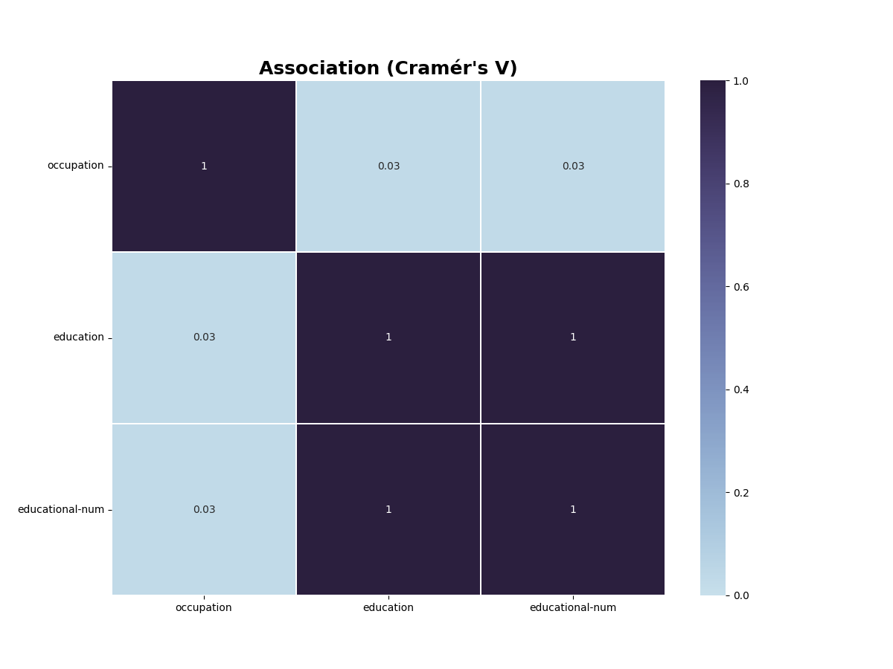
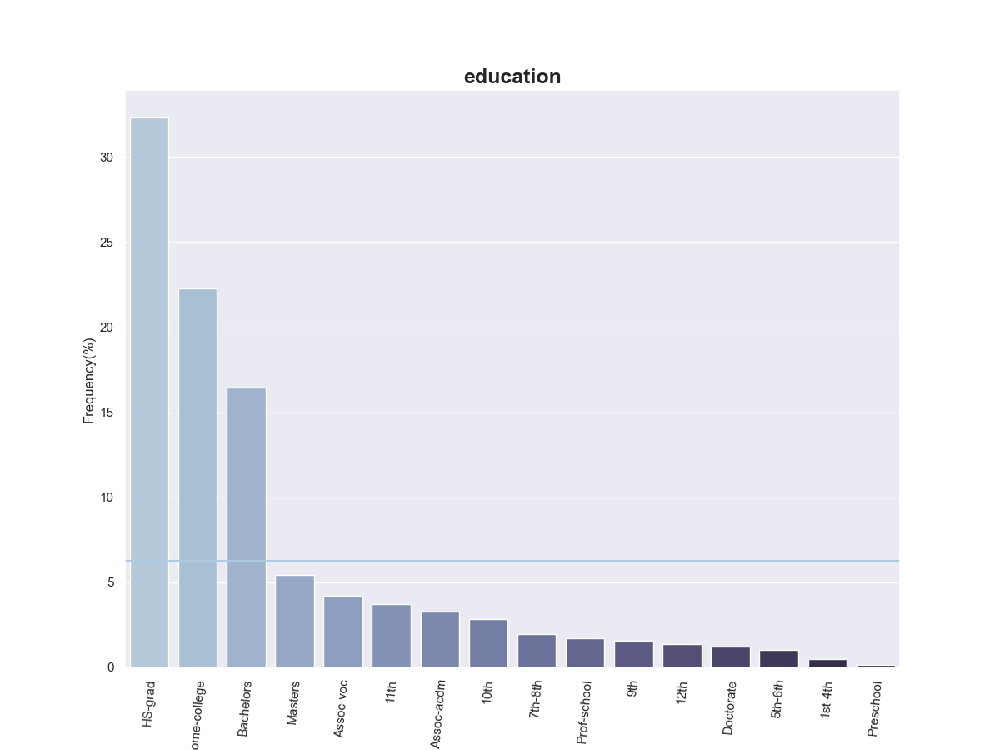
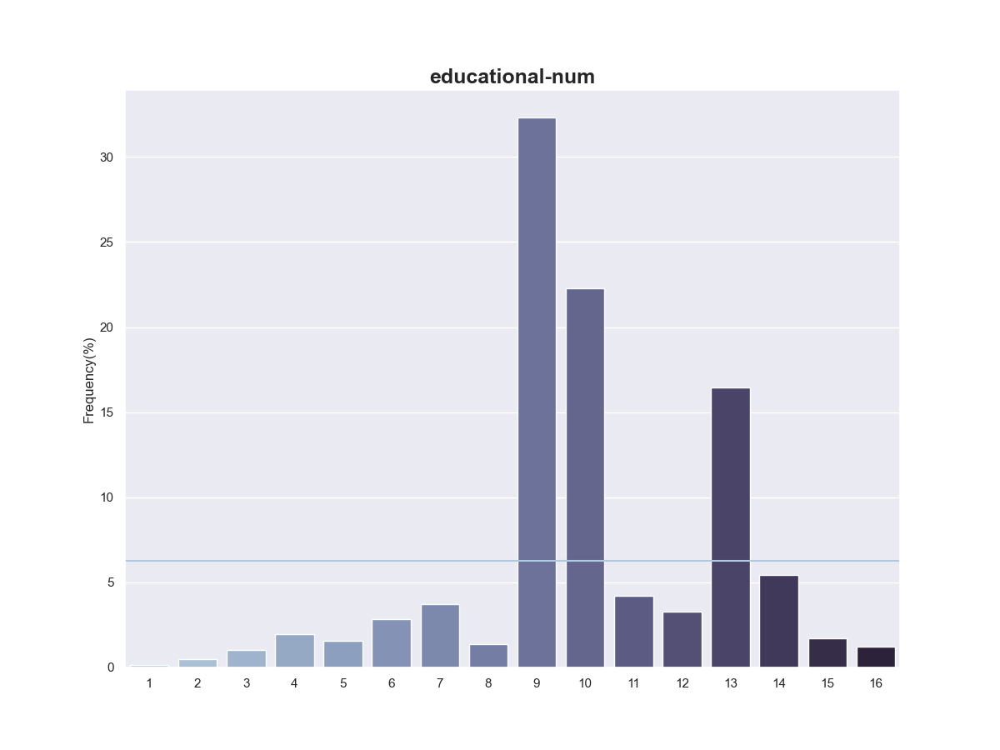
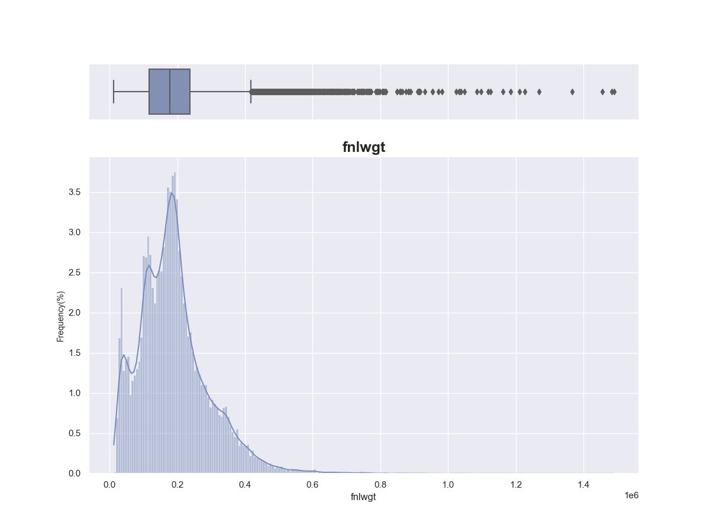

# `asapy.analysis`

## Module Contents

### Classes
|  |  |
| ------ | ------ |
| `Analysis`| The Analysis object.|

### _class_ asapy.analysis.Analysis()
The Analysis object.


#### _static_ hypothesis(df: pandas.DataFrame, alpha: float = 0.05, verbose: bool = False)
Method that performs hypothesis testing


* **Parameters**

    
    * **df** – (Pandas DataFrame)
    Input data (must contain at least two distributions).


    * **alpha** – (float)
    Significance level. Represents a cutoff value, a criterion that we set to reject or not H0. Default 0.05.


    * **verbose** – (bool, optional)
    Variable that defines whether or not to display detailed messages. Defaults to False.


* **Raises**

    
    * **ValueError** – Input variable is empty.


    * **ValueError** – Input data must match at least two distributions.


* **Returns**

    Indicates which distributions are statistically similar.


* **Return type**

    (Pandas DataFrame)


The figure below shows the flow of the hypothesis method:


Example usage:

```default
>>> import pandas as pd
>>> import asapy
>>> import numpy as np
>>> # Set random seed for reproducibility
>>> np.random.seed(123)
>>> # Create DataFrame with 5 columns and 100 rows
>>> data = pd.DataFrame({
>>>     'col0': np.random.gamma(1, size=100),
>>>     'col1': np.random.uniform(size=100),
>>>     'col2': np.random.exponential(size=100),
>>>     'col3': np.random.logistic(size=100),
>>>     'col4': np.random.pareto(1, size=100) + 1})
>>> output = asapy.Analysis.hypothesis(data, verbose = True)

Teste de normalidade
            W         pval  normal
----  --------  -----------  --------
col1   74.7177  5.96007e-17  False
col2   31.6041  1.3717e-07   False
col3   40.6985  1.45356e-09  False
col4   10.2107  0.00606431   False
col5  212.599   6.8361e-47   False
Conclusão: Ao menos uma distribuição não se assemelha à gaussiana (normal).

Teste de homocedasticidade
            W       pval  equal_var
------  -------  ---------  -----------
levene  2.03155  0.0888169  True
Conclusão: Distribuições possuem variâncias estatisticamente SEMELHANTES (homoscedasticidade).

Teste de Kruskal
statistic = 182.22539784431183, pvalue = 2.480716493859747e-38
Conclusão: Estatisticamente as amostras correspondem a distribuições DIFERENTES (Kruskal-Wallis).

Teste de Conover
            1             2             3             4             5
1  1.000000e+00  3.280180e-04  8.963739e-01  1.632161e-08  6.805120e-21
2  3.280180e-04  1.000000e+00  5.316246e-04  3.410392e-02  2.724152e-35
3  8.963739e-01  5.316246e-04  1.000000e+00  3.335991e-08  2.296912e-21
4  1.632161e-08  3.410392e-02  3.335991e-08  1.000000e+00  1.024363e-44
5  6.805120e-21  2.724152e-35  2.296912e-21  1.024363e-44  1.000000e+00

    dist1    dist2  same?
--  -------  -------  -------
0        0        1  False
1        0        2  False
2        0        3  False
3        0        4  False
4        1        2  False
5        1        3  True
6        1        4  False
7        2        3  False
8        2        4  False
9        3        4  False
```


#### _static_ fit_distribution(df: pandas.DataFrame, verbose: bool = False)
Find the distribution that best fits the input data.


* **Parameters**

    
    * **df** (*Pandas DataFrame*) – Input data (must contain only one distribution).


    * **verbose** (*bool**, **optional*) – Flag that controls whether detailed messages are displayed. Defaults to False.


* **Raises**

    **ValueError** – Input data must contain only one distribution.


* **Returns**

    DataFrame containing information about the distribution that best fit the input data, as well as the most common distributions (`norm`, `beta`, `chi2`, `uniform`, `expon`). The columns of the DataFrame are: `Distribution_Type`, `P_Value`, `Statistics`, and `Parameters`.


* **Return type**

    (Pandas DataFrame)


Example usage:

```default
>>> import pandas as pd
>>> from sklearn.datasets import load_wine
>>> X, y  = load_wine(as_frame=True, return_X_y=True)
>>> result = asapy.Analysis.fit_distribution(X[['magnesium']], verbose = True)
Distribution_Type      P_Value    Statistics  Parameters
-------------------  ---------  ------------  -------------------------------------
weibull_min           0.666605     0.0535577  (1.65, 77.23, 25.3)
beta                  0.585262     0.0571824  (6.06, 5334914.75, 65.16, 30436461.8)
norm                  0.110071     0.0892933  (99.74, 14.24)
expon                 0            0.317447   (70.0, 29.74)
uniform               0            0.386541   (70.0, 92.0)
chi2                  0            0.915856   (0.64, 70.0, 3.93)
```


#### _static_ feature_score(df: pandas.DataFrame, x: List[str], y: List[str], scoring_function: str, verbose: bool = False)
Calculate the score of input data.


* **Parameters**

    
    * **df** (*Pandas DataFrame*) – DataFrame with input data.


    * **x** (*List**[**str**]*) – Names of input variables (same name as the corresponding column of `df`).


    * **y** (*List**[**str**]*) – Names of output variables (same name as the corresponding column of `df`).


    * **scoring_function** (*str*) – Name of the scoring function.


    * **verbose** (*bool**, **optional*) – Flag to display detailed messages. Defaults to False.


* **Raises**

    **ValueError** – Invalid scoring_function name.


* **Returns**

    DataFrame with scores of input variables.


* **Return type**

    (Pandas DataFrame)


**WARNING**: Beware not to use a regression scoring function with a classification problem, you will get useless results

For regression: `r_regression`, `f_regression`, `mutual_info_regression`.

For classification: `chi2`, `f_classif`, `mutual_info_classif`.

Example usage:

```default
>>> import asapy
>>> from sklearn.datasets import load_diabetes
>>> # load dataset
>>> X, y  = load_diabetes(as_frame=True, return_X_y=True)
>>> # getting the input variable names
>>> feature_list = X.columns.tolist()
>>> # adding the output (target variable) in the data frame
>>> X['target'] = y
>>> scores = asapy.Analysis.feature_score(X,feature_list, ['target'], 'f_regression', verbose = True)

    bmi      s5      bp      s4     s3    s6     s1    age     s2    sex
--  ------  ------  ------  ------  -----  ----  -----  -----  -----  -----
0  230.65  207.27  106.52  100.07  81.24  75.4  20.71   16.1  13.75   0.82
```


#### _static_ pareto(df: pandas.DataFrame, min_list: List[str], max_list: List[str])
Returns a subset of the input DataFrame consisting of Pareto optimal points based on the specified columns.


* **Parameters**

    
    * **df** (*pd.DataFrame*) – The input DataFrame.


    * **min_list** (*List**[**str**]*) – A list of column names that should be minimized in the Pareto optimality calculation.


    * **max_list** (*List**[**str**]*) – A list of column names that should be maximized in the Pareto optimality calculation.


* **Returns**

    A DataFrame that contains the Pareto optimal points of the input DataFrame based on the specified columns.


* **Return type**

    pd.DataFrame


Example usage:

```default
>>> import pandas as pd
>>> from sklearn.datasets import load_wine
>>> X, y  = load_wine(as_frame=True, return_X_y=True)
>>> p = pareto(X, ['alcohol'], ['malic_acid','ash'])
>>> print(p.index.tolist())
[77, 88, 110, 112, 113, 115, 120, 121, 122, 123, 124, 136, 137, 169, 173]
```

**NOTE**: This function drops any row that contains missing values before performing the Pareto optimality calculation.

The columns specified in the min_list parameter will be multiplied by -1 to convert them into maximization criteria.


#### _static_ get_best_pareto_point(df: pandas.DataFrame, list_variable: List[str], weights: List[float], verbose: bool = False)
Calculate the best Pareto optimal point in the input DataFrame based on the specified variables and weights.


* **Parameters**

    
    * **df** (*pd.DataFrame*) – The input DataFrame.


    * **list_variable** (*List**[**str**]*) – A list of column names that should be considered in the Pareto optimality calculation.


    * **weights** (*List**[**float**]*) – A list of weights that determine the relative importance of each variable.


    * **verbose** (*bool*) – A flag that determines whether to print the best Pareto optimal point or not.


* **Returns**

    A DataFrame that contains the best Pareto optimal point based on the specified variables and weights.


* **Return type**

    pd.DataFrame


Example usage:

```default
>>> import asapy
>>> from sklearn.datasets import load_wine
>>> X, y  = load_wine(as_frame=True, return_X_y=True)
>>> p = asapy.Analysis.pareto(X, ['alcohol'], ['malic_acid','ash'])
>>> best = asapy.Analysis.get_best_pareto_point(p,['alcohol', 'malic_acid', 'ash'],[0.0,0.9,0.1], True)
Melhor opção de acordo com a decomposição: Ponto 115 - [11.03  1.51  2.2 ]
```

**NOTE**: This function assumes that the input DataFrame contains only Pareto optimal points.

The weights parameter should contain a value for each variable specified in the list_variable parameter.


#### _static_ detect_outliers(df: pandas.DataFrame, method: str = 'IQR', thr: float = 3, verbose: bool = False)
Detect outliers in a Pandas DataFrame using IQR or zscore method.


* **Parameters**

    
    * **df** (*Pandas DataFrame*) – Input DataFrame containing numerical data.


    * **method** (*str**, **optional*) – Method to use for outlier detection. Available options: ‘IQR’ or ‘zscore’. Defaults to ‘IQR’.


    * **thr** (*int**, **optional*) – Threshold value for zscore method. Defaults to 3.


    * **verbose** (*bool**, **optional*) – Determines whether to display detailed messages. Defaults to False.


* **Raises**

    **ValueError** – If method is not equal to one of the following options: ‘IQR’ or ‘zscore’.


* **Returns**

    tuple containing


    * (Pandas DataFrame): DataFrame containing the index of the outliers.


    * (Pandas DataFrame): The columns of the DataFrame are: `column`, `min_thres`, `max_thres`. Values smaller than `min_thres` and larger than `max_thres` are considered outliers for IQR method.


Example usage:

```default
>>> import asapy
>>> from sklearn.datasets import load_diabetes
>>> # load dataset
>>> X, y  = load_diabetes(as_frame=True, return_X_y=True)
>>> df, df_thres = asapy.Analysis().detect_outliers(X, verbose = True)
      outliers_index
--  ----------------
0                23
1                35
2                58
...
28               406
29               428
30               441
```


#### remove_outliers(df: pandas.DataFrame, verbose: bool = False)
Remove outliers from a Pandas DataFrame using the Interquartile Range (IQR) method.


* **Parameters**

    
    * **df** (*Pandas DataFrame*) – DataFrame containing the data.


    * **verbose** (*bool**, **optional*) – If True, print the number of lines removed. Defaults to False.


* **Returns**

    tuple containing


    * df_new (Pandas DataFrame): DataFrame with the outliers removed.


    * drop_lines (list): List of indexes of the rows that were removed.


Example usage:

```default
>>> import asapy
>>> from sklearn.datasets import load_diabetes
>>> # load dataset
>>> X, y  = load_diabetes(as_frame=True, return_X_y=True)
>>> df_new, drop_lines = asapy.Analysis().remove_outliers(X, verbose = True)
Foram removidas 31 linhas.
```


#### _static_ cramer_V(df: pandas.DataFrame, verbose: bool = False, save: bool = False, path: str = None, format: str = 'png')
Calculate Cramer’s V statistic for categorical feature association in a DataFrame.

Cramer’s V is a measure of association between two categorical variables. It is based on the `chi-squared` statistic
and considers both the strength and direction of association. This function calculates Cramer’s V for all pairs of
categorical variables in a given DataFrame and returns the results in a new DataFrame.


* **Parameters**

    
    * **df** (*pandas DataFrame*) – The input DataFrame containing the categorical variables.


    * **verbose** (*bool**, **optional*) – If True, a heatmap of the Cramer’s V values will be displayed using Seaborn. Default is False.


* **Returns**

    A DataFrame containing Cramer’s V values for all pairs of categorical variables.


* **Return type**

    (pandas DataFrame)


Example usage:

```default
>>> import pandas as pd
>>> import asapy
>>> # Create a sample DataFrame
>>> df = pd.DataFrame({'A': ['cat', 'dog', 'bird', 'cat', 'dog'],
...                    'B': ['small', 'large', 'medium', 'medium', 'small'],
...                    'C': ['red', 'blue', 'green', 'red', 'blue']})
>>> # Calculate Cramer's V
>>> cramer_df = asapy.Analysis.cramer_V(df, verbose=True)
```


#### EDA(df: pandas.DataFrame, save: bool = False, path: str = None, format: str = 'png')
Perform exploratory data analysis (EDA) on a given pandas DataFrame.

The function displays a summary table of the DataFrame, a table of class balance for categorical variables,
and histograms and boxplots with information on the number of outliers for numerical variables.


* **Parameters**

    
    * **df** (*pandas.DataFrame*) – Input DataFrame to be analyzed.


    * **save** (*bool**, **optional*) – If True, save the plots. Defaults to False.


    * **path** (*str**, **optional*) – Path to save the plots. Defaults to None.


    * **format** (*str**, **optional*) – Format for the plot files. Defaults to ‘png’.


* **Returns**

    None


Example Usage:

```default
>>> import asapy
>>> import pandas as pd
>>> df = pd.read_csv('path-to-dataset.csv')
>>> asapy.Analysis().EDA(df)

Variáveis Categóricas:

        occupation      education      educational-num
------  --------------  -----------  -----------------
nan     0               0                            0
count   48842           48842                    48842
unique  15              16                          16
top     Prof-specialty  HS-grad                      9
freq    6172            15784                    15784


Associação:
```




```default
Histogramas:
```







```default
Variáveis Numéricas:
            age           fnlwgt
-----  ----------  ---------------
nan        0            0
count  48842        48842
mean      38.6436  189664
std       13.7105  105604
min       17        12285
25%       28       117550
50%       37       178144
75%       48       237642
max       90            1.4904e+06

Correlação:
```


```default
Histogramas e boxplots:
```


```default
Detecção de outlier da variável 'age':
Quantidade: 216 de 48842.
Método: Intervalo Interquartil (IQR - Interquatile Range).
Critério: Os valores menores que -2.0 ou maiores que 78.0 foram considerados outliers.
```




```default
Detecção de outlier da variável 'fnlwgt':
Quantidade: 1453 de 48842.
Método: Intervalo Interquartil (IQR - Interquatile Range).
Critério: Os valores menores que -62586.75 ou maiores que 417779.25 foram considerados outliers.
```
