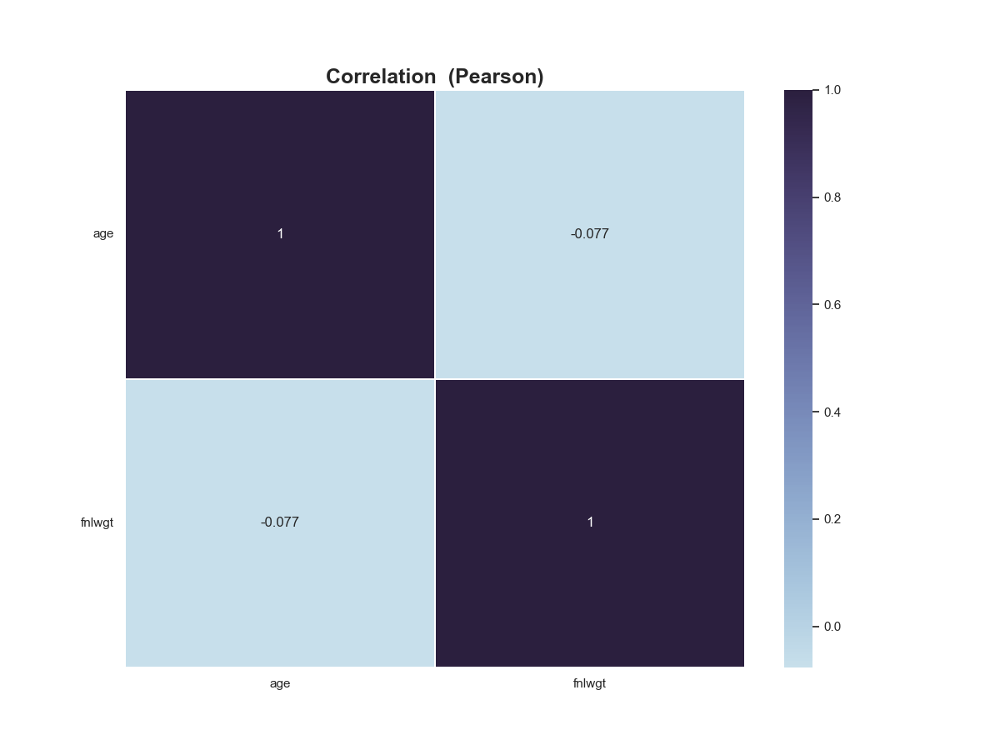
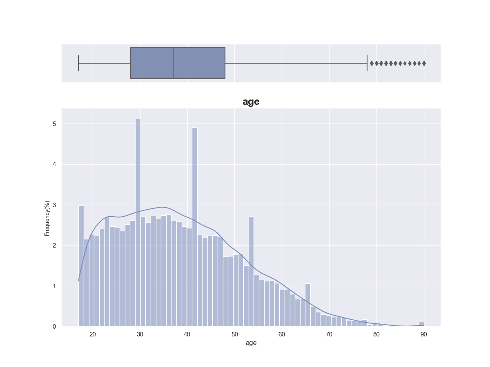
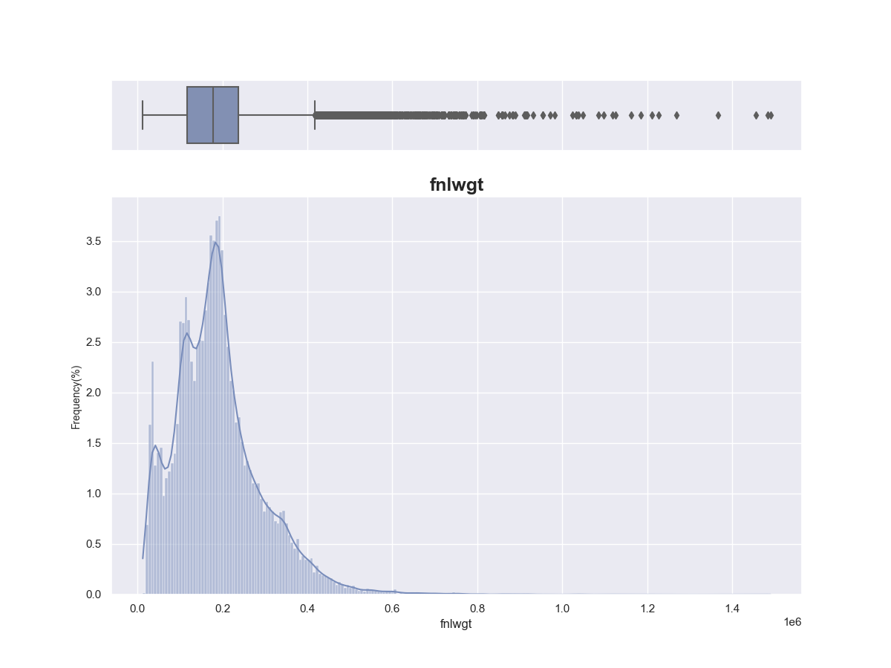

# `asapy`

## Submodules


* [`asapy.analysis`](analysis/index.md)


* [`asapy.doe`](doe/index.md)


* [`asapy.execution_controller`](execution_controller/index.md)


* [`asapy.models`](models/index.md)


* [`asapy.utils`](utils/index.md)


## Package Contents

### Classes

|  |  |
| ------ | ------ |
| `Doe`| |
| `Analysis`| The Analysis object.|
| `NN`| The class NN is a wrapper around Keras Sequential API, which provides an easy way to create and train neural network models. It can perform hyperparameters search and model building with specified hyperparameters.|
| `RandomForest`| This class is used to build and search hyperparameters for a random forest model in scikit-learn.|
| `Scaler`| The Scaler class is designed to scale and transform data using various scaling techniques. It contains methods for fitting and transforming data, as well as saving and loading scaler objects to and from files.|
| `AsaML`| |

### _class_ asapy.Doe()

#### _static_ _get_aliases(sim)
Returns a generator that yields dictionaries containing information about aliases found within the input sim parameter.


* **Parameters**

    **sim** (*dict*) – A dictionary representing the simulation object.


* **Yields**

    *dict* – A dictionary containing information about an alias, including its id, alias_attribute, and alias.


Example Usage:

```default
>>> #To extract aliases from a simulation object `sim`, you can use the following code:
>>> for alias_info in Doe._get_aliases(sim):
...     print(alias_info)
```

**NOTE**: 
* This method checks if the input sim has an alias key with a non-empty value. If found, it iterates through the key-value pairs of the value dictionary and yields a dictionary containing information about the alias.


* If the value of the key-value pair is a dictionary, the method recursively calls itself with the dictionary as the new input sim parameter.


* If the value of the key-value pair is a list, it iterates through the list and recursively calls itself with each dictionary in the list as the new input sim parameter.


#### _static_ _get_configs(configs, alias)
Recursively searches for the attribute of the given alias in a list of configurations.

Args:
- configs (list of dicts): List of configuration dictionaries
- alias (dict): Dictionary containing the alias attribute to be searched and the id to match

Returns:
- Generator object that yields the value of the alias attribute whenever it is found


#### process_aliases_by_sim(sim, configs)
Process aliases based on similarity and configurations.

Parameters:
sim (list): A list of dictionaries, containing ‘id’ and ‘text’ keys.
configs (list): A list of dictionaries, containing ‘identifier’, ‘attributes’, and ‘alias_attribute’ keys.

Returns:
DataFrame: A DataFrame containing aliases and their corresponding attributes.


#### _static_ create(df_T, samples)
Creates a design of experiments (DOE) based on the input DataFrame `df_T`.
The DOE is created using a Latin Hypercube Sampling (LHS) method and a sample size `samples`.
The function returns a new DataFrame with the input variables’ names and values according to their type.


* **Parameters**

    
    * **df_T** – A DataFrame of the variables’ metadata. The index should contain the variables’ names, and the following columns


    * **exist** (*should*) – 
        * “type”: Variable’s type: integer, double, boolean, select, multi_select, or string.


        * ”default”: Default value for the variable.


        * ”min”: Minimum value for the variable (if applicable).


        * ”max”: Maximum value for the variable (if applicable).


        * ”options”: Available options for the variable (if applicable).


    * **samples** – An integer value indicating the number of samples in the design.


* **Returns**

    A new DataFrame containing the input variables’ names and values, generated using LHS sampling.


* **Raises**

    
    * **TypeError** – If `df_T` is not a pandas DataFrame or `samples` is not an integer.


    * **ValueError** – If `df_T` does not contain the required columns or the `default` value is not within the `min` and `max` range.


#### _static_ prepare_experiments(df)
Prepare a list of experiments from a Pandas DataFrame.


* **Parameters**

    **df** – A Pandas DataFrame containing experiment data.


* **Returns**

    A list of dictionaries, where each dictionary represents an experiment and its attributes.


* **Raises**

    **None.** – 


#### _static_ _get_metrics(sim)
Recursively extract monitor metrics from a simulation dictionary.


* **Parameters**

    **sim** (*dict*) – A simulation dictionary.


* **Yields**

    *dict* – A dictionary containing the workspace name, simulation identifier, and monitor metrics.


#### process_metrics(sim)
Process the metrics obtained from a simulation.


* **Parameters**

    **sim** – A dictionary containing the simulation data.


* **Returns**

    A pandas DataFrame containing the metrics indexed by workspace name.


* **Raises**

    **None** – 


### _class_ asapy.Analysis()
The Analysis object.


#### _static_ hypothesis(df: pandas.DataFrame, alpha: float = 0.05, verbose: bool = False)
Method that performs hypothesis testing


* **Parameters**

    
    * **df** – (Pandas DataFrame)
    Input data (must contain at least two distributions).


    * **alpha** – (float)
    Significance level. Represents a cutoff value, a criterion that we set to reject or not H0. Default 0.05.


    * **verbose** – (bool, optional)
    Variable that defines whether or not to display detailed messages. Defaults to False.


* **Raises**

    
    * **ValueError** – Input variable is empty.


    * **ValueError** – Input data must match at least two distributions.


* **Returns**

    Indicates which distributions are statistically similar.


* **Return type**

    (Pandas DataFrame)


The figure below shows the flow of the hypothesis method:


Example usage:

```default
>>> import pandas as pd
>>> import asapy
>>> import numpy as np
>>> # Set random seed for reproducibility
>>> np.random.seed(123)
>>> # Create DataFrame with 5 columns and 100 rows
>>> data = pd.DataFrame({
>>>     'col0': np.random.gamma(1, size=100),
>>>     'col1': np.random.uniform(size=100),
>>>     'col2': np.random.exponential(size=100),
>>>     'col3': np.random.logistic(size=100),
>>>     'col4': np.random.pareto(1, size=100) + 1})
>>> output = asapy.Analysis.hypothesis(data, verbose = True)

Teste de normalidade
            W         pval  normal
----  --------  -----------  --------
col1   74.7177  5.96007e-17  False
col2   31.6041  1.3717e-07   False
col3   40.6985  1.45356e-09  False
col4   10.2107  0.00606431   False
col5  212.599   6.8361e-47   False
Conclusão: Ao menos uma distribuição não se assemelha à gaussiana (normal).

Teste de homocedasticidade
            W       pval  equal_var
------  -------  ---------  -----------
levene  2.03155  0.0888169  True
Conclusão: Distribuições possuem variâncias estatisticamente SEMELHANTES (homoscedasticidade).

Teste de Kruskal
statistic = 182.22539784431183, pvalue = 2.480716493859747e-38
Conclusão: Estatisticamente as amostras correspondem a distribuições DIFERENTES (Kruskal-Wallis).

Teste de Conover
            1             2             3             4             5
1  1.000000e+00  3.280180e-04  8.963739e-01  1.632161e-08  6.805120e-21
2  3.280180e-04  1.000000e+00  5.316246e-04  3.410392e-02  2.724152e-35
3  8.963739e-01  5.316246e-04  1.000000e+00  3.335991e-08  2.296912e-21
4  1.632161e-08  3.410392e-02  3.335991e-08  1.000000e+00  1.024363e-44
5  6.805120e-21  2.724152e-35  2.296912e-21  1.024363e-44  1.000000e+00

    dist1    dist2  same?
--  -------  -------  -------
0        0        1  False
1        0        2  False
2        0        3  False
3        0        4  False
4        1        2  False
5        1        3  True
6        1        4  False
7        2        3  False
8        2        4  False
9        3        4  False
```


#### _static_ fit_distribution(df: pandas.DataFrame, verbose: bool = False)
Find the distribution that best fits the input data.


* **Parameters**

    
    * **df** (*Pandas DataFrame*) – Input data (must contain only one distribution).


    * **verbose** (*bool**, **optional*) – Flag that controls whether detailed messages are displayed. Defaults to False.


* **Raises**

    **ValueError** – Input data must contain only one distribution.


* **Returns**

    DataFrame containing information about the distribution that best fit the input data, as well as the most common distributions (`norm`, `beta`, `chi2`, `uniform`, `expon`). The columns of the DataFrame are: `Distribution_Type`, `P_Value`, `Statistics`, and `Parameters`.


* **Return type**

    (Pandas DataFrame)


Example usage:

```default
>>> import pandas as pd
>>> from sklearn.datasets import load_wine
>>> X, y  = load_wine(as_frame=True, return_X_y=True)
>>> result = asapy.Analysis.fit_distribution(X[['magnesium']], verbose = True)
Distribution_Type      P_Value    Statistics  Parameters
-------------------  ---------  ------------  -------------------------------------
weibull_min           0.666605     0.0535577  (1.65, 77.23, 25.3)
beta                  0.585262     0.0571824  (6.06, 5334914.75, 65.16, 30436461.8)
norm                  0.110071     0.0892933  (99.74, 14.24)
expon                 0            0.317447   (70.0, 29.74)
uniform               0            0.386541   (70.0, 92.0)
chi2                  0            0.915856   (0.64, 70.0, 3.93)
```


#### _static_ feature_score(df: pandas.DataFrame, x: List[str], y: List[str], scoring_function: str, verbose: bool = False)
Calculate the score of input data.


* **Parameters**

    
    * **df** (*Pandas DataFrame*) – DataFrame with input data.


    * **x** (*List**[**str**]*) – Names of input variables (same name as the corresponding column of `df`).


    * **y** (*List**[**str**]*) – Names of output variables (same name as the corresponding column of `df`).


    * **scoring_function** (*str*) – Name of the scoring function.


    * **verbose** (*bool**, **optional*) – Flag to display detailed messages. Defaults to False.


* **Raises**

    **ValueError** – Invalid scoring_function name.


* **Returns**

    DataFrame with scores of input variables.


* **Return type**

    (Pandas DataFrame)


**WARNING**: Beware not to use a regression scoring function with a classification problem, you will get useless results

For regression: `r_regression`, `f_regression`, `mutual_info_regression`.

For classification: `chi2`, `f_classif`, `mutual_info_classif`.

Example usage:

```default
>>> import asapy
>>> from sklearn.datasets import load_diabetes
>>> # load dataset
>>> X, y  = load_diabetes(as_frame=True, return_X_y=True)
>>> # getting the input variable names
>>> feature_list = X.columns.tolist()
>>> # adding the output (target variable) in the data frame
>>> X['target'] = y
>>> scores = asapy.Analysis.feature_score(X,feature_list, ['target'], 'f_regression', verbose = True)

    bmi      s5      bp      s4     s3    s6     s1    age     s2    sex
--  ------  ------  ------  ------  -----  ----  -----  -----  -----  -----
0  230.65  207.27  106.52  100.07  81.24  75.4  20.71   16.1  13.75   0.82
```


#### _static_ pareto(df: pandas.DataFrame, min_list: List[str], max_list: List[str])
Returns a subset of the input DataFrame consisting of Pareto optimal points based on the specified columns.


* **Parameters**

    
    * **df** (*pd.DataFrame*) – The input DataFrame.


    * **min_list** (*List**[**str**]*) – A list of column names that should be minimized in the Pareto optimality calculation.


    * **max_list** (*List**[**str**]*) – A list of column names that should be maximized in the Pareto optimality calculation.


* **Returns**

    A DataFrame that contains the Pareto optimal points of the input DataFrame based on the specified columns.


* **Return type**

    pd.DataFrame


Example usage:

```default
>>> import pandas as pd
>>> from sklearn.datasets import load_wine
>>> X, y  = load_wine(as_frame=True, return_X_y=True)
>>> p = pareto(X, ['alcohol'], ['malic_acid','ash'])
>>> print(p.index.tolist())
[77, 88, 110, 112, 113, 115, 120, 121, 122, 123, 124, 136, 137, 169, 173]
```

**NOTE**: This function drops any row that contains missing values before performing the Pareto optimality calculation.

The columns specified in the min_list parameter will be multiplied by -1 to convert them into maximization criteria.


#### _static_ get_best_pareto_point(df: pandas.DataFrame, list_variable: List[str], weights: List[float], verbose: bool = False)
Calculate the best Pareto optimal point in the input DataFrame based on the specified variables and weights.


* **Parameters**

    
    * **df** (*pd.DataFrame*) – The input DataFrame.


    * **list_variable** (*List**[**str**]*) – A list of column names that should be considered in the Pareto optimality calculation.


    * **weights** (*List**[**float**]*) – A list of weights that determine the relative importance of each variable.


    * **verbose** (*bool*) – A flag that determines whether to print the best Pareto optimal point or not.


* **Returns**

    A DataFrame that contains the best Pareto optimal point based on the specified variables and weights.


* **Return type**

    pd.DataFrame


Example usage:

```default
>>> import asapy
>>> from sklearn.datasets import load_wine
>>> X, y  = load_wine(as_frame=True, return_X_y=True)
>>> p = asapy.Analysis.pareto(X, ['alcohol'], ['malic_acid','ash'])
>>> best = asapy.Analysis.get_best_pareto_point(p,['alcohol', 'malic_acid', 'ash'],[0.0,0.9,0.1], True)
Melhor opção de acordo com a decomposição: Ponto 115 - [11.03  1.51  2.2 ]
```

**NOTE**: This function assumes that the input DataFrame contains only Pareto optimal points.

The weights parameter should contain a value for each variable specified in the list_variable parameter.


#### _static_ detect_outliers(df: pandas.DataFrame, method: str = 'IQR', thr: float = 3, verbose: bool = False)
Detect outliers in a Pandas DataFrame using IQR or zscore method.


* **Parameters**

    
    * **df** (*Pandas DataFrame*) – Input DataFrame containing numerical data.


    * **method** (*str**, **optional*) – Method to use for outlier detection. Available options: ‘IQR’ or ‘zscore’. Defaults to ‘IQR’.


    * **thr** (*int**, **optional*) – Threshold value for zscore method. Defaults to 3.


    * **verbose** (*bool**, **optional*) – Determines whether to display detailed messages. Defaults to False.


* **Raises**

    **ValueError** – If method is not equal to one of the following options: ‘IQR’ or ‘zscore’.


* **Returns**

    tuple containing


    * (Pandas DataFrame): DataFrame containing the index of the outliers.


    * (Pandas DataFrame): The columns of the DataFrame are: `column`, `min_thres`, `max_thres`. Values smaller than `min_thres` and larger than `max_thres` are considered outliers for IQR method.


Example usage:

```default
>>> import asapy
>>> from sklearn.datasets import load_diabetes
>>> # load dataset
>>> X, y  = load_diabetes(as_frame=True, return_X_y=True)
>>> df, df_thres = asapy.Analysis().detect_outliers(X, verbose = True)
      outliers_index
--  ----------------
0                23
1                35
2                58
...
28               406
29               428
30               441
```


#### remove_outliers(df: pandas.DataFrame, verbose: bool = False)
Remove outliers from a Pandas DataFrame using the Interquartile Range (IQR) method.


* **Parameters**

    
    * **df** (*Pandas DataFrame*) – DataFrame containing the data.


    * **verbose** (*bool**, **optional*) – If True, print the number of lines removed. Defaults to False.


* **Returns**

    tuple containing


    * df_new (Pandas DataFrame): DataFrame with the outliers removed.


    * drop_lines (list): List of indexes of the rows that were removed.


Example usage:

```default
>>> import asapy
>>> from sklearn.datasets import load_diabetes
>>> # load dataset
>>> X, y  = load_diabetes(as_frame=True, return_X_y=True)
>>> df_new, drop_lines = asapy.Analysis().remove_outliers(X, verbose = True)
Foram removidas 31 linhas.
```


#### _static_ cramer_V(df: pandas.DataFrame, verbose: bool = False, save: bool = False, path: str = None, format: str = 'png')
Calculate Cramer’s V statistic for categorical feature association in a DataFrame.

Cramer’s V is a measure of association between two categorical variables. It is based on the `chi-squared` statistic
and considers both the strength and direction of association. This function calculates Cramer’s V for all pairs of
categorical variables in a given DataFrame and returns the results in a new DataFrame.


* **Parameters**

    
    * **df** (*pandas DataFrame*) – The input DataFrame containing the categorical variables.


    * **verbose** (*bool**, **optional*) – If True, a heatmap of the Cramer’s V values will be displayed using Seaborn. Default is False.


* **Returns**

    A DataFrame containing Cramer’s V values for all pairs of categorical variables.


* **Return type**

    (pandas DataFrame)


Example usage:

```default
>>> import pandas as pd
>>> import asapy
>>> # Create a sample DataFrame
>>> df = pd.DataFrame({'A': ['cat', 'dog', 'bird', 'cat', 'dog'],
...                    'B': ['small', 'large', 'medium', 'medium', 'small'],
...                    'C': ['red', 'blue', 'green', 'red', 'blue']})
>>> # Calculate Cramer's V
>>> cramer_df = asapy.Analysis.cramer_V(df, verbose=True)
```


#### EDA(df: pandas.DataFrame, save: bool = False, path: str = None, format: str = 'png')
Perform exploratory data analysis (EDA) on a given pandas DataFrame.

The function displays a summary table of the DataFrame, a table of class balance for categorical variables,
and histograms and boxplots with information on the number of outliers for numerical variables.


* **Parameters**

    
    * **df** (*pandas.DataFrame*) – Input DataFrame to be analyzed.


    * **save** (*bool**, **optional*) – If True, save the plots. Defaults to False.


    * **path** (*str**, **optional*) – Path to save the plots. Defaults to None.


    * **format** (*str**, **optional*) – Format for the plot files. Defaults to ‘png’.


* **Returns**

    None


Example Usage:

```default
>>> import asapy
>>> import pandas as pd
>>> df = pd.read_csv('path-to-dataset.csv')
>>> asapy.Analysis().EDA(df)

Variáveis Categóricas:

        occupation      education      educational-num
------  --------------  -----------  -----------------
nan     0               0                            0
count   48842           48842                    48842
unique  15              16                          16
top     Prof-specialty  HS-grad                      9
freq    6172            15784                    15784


Associação:
```


```default
Histogramas:
```


```default
Variáveis Numéricas:
            age           fnlwgt
-----  ----------  ---------------
nan        0            0
count  48842        48842
mean      38.6436  189664
std       13.7105  105604
min       17        12285
25%       28       117550
50%       37       178144
75%       48       237642
max       90            1.4904e+06

Correlação:
```




```default
Histogramas e boxplots:
```




```default
Detecção de outlier da variável 'age':
Quantidade: 216 de 48842.
Método: Intervalo Interquartil (IQR - Interquatile Range).
Critério: Os valores menores que -2.0 ou maiores que 78.0 foram considerados outliers.
```




```default
Detecção de outlier da variável 'fnlwgt':
Quantidade: 1453 de 48842.
Método: Intervalo Interquartil (IQR - Interquatile Range).
Critério: Os valores menores que -62586.75 ou maiores que 417779.25 foram considerados outliers.
```


### _class_ asapy.NN(model=None)
Bases: `Model`

The class NN is a wrapper around Keras Sequential API, which provides an easy way to create and train neural network models. It can perform hyperparameters search and model building with specified hyperparameters.

#### Attributes:

> 
> * model: the built Keras model.


> * loss: the loss function used to compile the Keras model.


> * metrics: the metrics used to compile the Keras model.


> * dir_name: a string that defines the name of the directory to save the hyperparameters search results.


> * input_shape: the shape of the input data for the Keras model.


> * output_shape: the shape of the output data for the Keras model.


#### _model_search(hp, \*\*kwargs)
Searches for the best hyperparameters to create a Keras model using the given hyperparameters space.


* **Parameters**

    **hp** (*keras_tuner.engine.hyperparameters.HyperParameters*) – Object that holds
    the hyperparameters space to search.


* **Returns**

    A compiled Keras model with the best hyperparameters found.


#### search_hyperparams(X, y, project_name='', verbose=False)
Perform hyperparameter search for the neural network using Keras Tuner.


* **Parameters**

    
    * **X** (*numpy.ndarray*) – Input data.


    * **y** (*numpy.ndarray*) – Target data.


    * **project_name** (*str*) – Name of the Keras Tuner project (default ‘’).


    * **verbose** (*bool*) – Whether or not to print out information about the search progress (default False).


* **Returns**

    A dictionary containing the optimal hyperparameters found by the search.


* **Return type**

    dict


* **Raises**

    **ValueError** – If self.loss is not a supported loss function.


#### build(input_shape=(1,), output_shape=(1,), n_neurons=[1], n_layers=1, learning_rate=0.001, activation='relu', \*\*kwargs)
Builds a Keras neural network model with the given hyperparameters.


* **Parameters**

    
    * **input_shape** (*tuple**, **optional*) – The shape of the input data. Defaults to (1,).


    * **output_shape** (*tuple**, **optional*) – The shape of the output data. Defaults to (1,).


    * **n_neurons** (*list**, **optional*) – A list of integers representing the number of neurons in each hidden layer.
    The length of the list determines the number of hidden layers. Defaults to [1].


    * **n_layers** (*int**, **optional*) – The number of hidden layers in the model. Defaults to 1.


    * **learning_rate** (*float**, **optional*) – The learning rate of the optimizer. Defaults to 1e-3.


    * **activation** (*str**, **optional*) – The activation function used for the hidden layers. Defaults to ‘relu’.


* **Returns**

    None.


#### load(path)
Load a Keras model from an H5 file.


* **Parameters**

    **path** (*str*) – Path to the H5 file containing the Keras model.


* **Raises**

    **ValueError** – If the file extension is not ‘.h5’.


* **Returns**

    None


#### predict(x)
Uses the trained neural network to make predictions on input data.


* **Parameters**

    **x** (*numpy.ndarray*) – Input data to be used for prediction. It must have the same number of features
    as the input_shape used to build the network.


* **Returns**

    Predicted outputs for the input data.


* **Return type**

    numpy.ndarray


* **Raises**

    **ValueError** – If the input data x does not have the same number of features as the input_shape
    used to build the network.


#### fit(x, y, validation_data, batch_size=32, epochs=500, save=True, patience=5, path='')
Trains the neural network model using the given input and output data.


* **Parameters**

    
    * **x** (*numpy array*) – The input data used to train the model.


    * **y** (*numpy array*) – The output data used to train the model.


    * **validation_data** (*tuple*) – A tuple containing the validation data as input and output data.


    * **batch_size** (*int*) – The batch size used for training the model (default=32).


    * **epochs** (*int*) – The number of epochs used for training the model (default=500).


    * **save** (*bool*) – Whether to save the model after training (default=True).


    * **patience** (*int*) – The number of epochs to wait before early stopping if the validation loss does not improve (default=5).


    * **path** (*str*) – The path to save the trained model (default=’’).


* **Returns**

    None


#### save(path)
Saves the trained neural network model to a file.


* **Parameters**

    **path** – A string specifying the path and filename for the saved model. The “.h5” file extension
    will be appended to the provided filename if not already present.


* **Raises**

    **ValueError** – If the provided file extension is not “.h5”.


* **Returns**

    None


### _class_ asapy.RandomForest(model=None)
Bases: `Model`

This class is used to build and search hyperparameters for a random forest model in scikit-learn.

#### Attributes:

> 
> * model: the built RandomForest scikit-learn model.


#### search_hyperparams(X, y, verbose=False, \*\*kwargs)
Perform a hyperparameter search for a Random Forest model using RandomizedSearchCV.


* **Parameters**

    
    * **X** (*numpy array*) – The feature matrix of the data.


    * **y** (*numpy array*) – The target vector of the data.


    * **verbose** (*bool**, **optional*) – If True, print the optimal hyperparameters. Defaults to False.


    * **\*\*kwargs** – Additional keyword arguments. The following hyperparameters can be set:
    - n_estimators (int): Number of trees in the forest. Defaults to sp_randint(10, 1000).
    - max_features (list): The number of features to consider when looking for the best split.
    Allowed values are ‘sqrt’, ‘log2’ or a float between 0 and 1. Defaults to [‘sqrt’, ‘log2’].
    - max_depth (list): The maximum depth of the tree. Defaults to [None, 5, 10, 15, 20, 30, 40].
    - min_samples_split (int): The minimum number of samples required to split an internal node.
    Defaults to sp_randint(2, 20).
    - min_samples_leaf (int): The minimum number of samples required to be at a leaf node.
    Defaults to sp_randint(1, 20).
    - bootstrap (bool): Whether bootstrap samples are used when building trees.
    Defaults to [True, False].
    - y_type (str): Type of target variable. Either ‘num’ for numeric or ‘cat’ for categorical.
    Defaults to ‘cat’.


* **Returns**

    A dictionary with the best hyperparameters found during the search.


* **Return type**

    dict


#### build(n_estimators=100, max_depth=None, min_samples_split=2, min_samples_leaf=1, max_features='sqrt', \*\*kwargs)
Builds a new Random Forest model with the specified hyperparameters.


* **Parameters**

    
    * **n_estimators** (*int**, **optional*) – The number of trees in the forest. Default is 100.


    * **max_depth** (*int** or **None**, **optional*) – The maximum depth of each tree. None means unlimited. Default is None.


    * **min_samples_split** (*int**, **optional*) – The minimum number of samples required to split an internal node. Default is 2.


    * **min_samples_leaf** (*int**, **optional*) – The minimum number of samples required to be at a leaf node. Default is 1.


    * **max_features** (*str** or **int**, **optional*) – The maximum number of features to consider when looking for the best split.
    Can be ‘sqrt’, ‘log2’, an integer or None. Default is ‘sqrt’.


    * **\*\*kwargs** – Additional keyword arguments. Must include a ‘y_type’ parameter, which should be set to ‘num’ for
    regression problems and ‘cat’ for classification problems.


* **Returns**

    None


#### load(path)
Load a saved random forest model.


* **Parameters**

    **path** (*str*) – The path to the saved model file. The file must be a joblib file with the extension ‘.joblib’.


* **Raises**

    **ValueError** – If the extension of the file is not ‘.joblib’.


* **Returns**

    None.


#### predict(x)
Makes predictions using the trained Random Forest model on the given input data.


* **Parameters**

    **x** – The input data to make predictions on.


* **Returns**

    An array of predicted target values.


#### fit(x, y)
Trains the Random Forest model on the given input and target data.


* **Parameters**

    
    * **x** – The input data to train the model on.


    * **y** – The target data to train the model on.


* **Returns**

    None


#### save(path)
Saves the trained model to a file with the specified path.


* **Parameters**

    **path** (*str*) – The file path where the model should be saved. The file extension should be ‘.joblib’.


* **Raises**

    **ValueError** – If the file extension is invalid or missing.


* **Returns**

    None


### _class_ asapy.Scaler(scaler=None)
The Scaler class is designed to scale and transform data using various scaling techniques. It contains methods for fitting and transforming data, as well as saving and loading scaler objects to and from files.


#### fit_transform(data)
Fit to data, then transform it.


* **Parameters**

    **data** (*array-like*) – The data to be transformed.


* **Returns**

    The transformed data.


* **Return type**

    array-like


#### transform(data)
Perform standardization on an array.


* **Parameters**

    **data** (*array-like*) – The data to be standardized.


* **Returns**

    The standardized data.


* **Return type**

    array-like


#### inverse_transform(data)
Scale back the data to the original representation.


* **Parameters**

    **data** (*array-like*) – The data to be scaled back.


* **Returns**

    The original representation of the data.


* **Return type**

    array-like


#### save(path)
Save the scaler object to a file.


* **Parameters**

    **path** (*str*) – The path where the scaler object will be saved.


#### load(path)
Load a saved scaler object from a file.


* **Parameters**

    **path** (*str*) – The path where the scaler object is saved.


### _class_ asapy.AsaML(dir_name=None)

#### _static_ identify_categorical_data(df)
Identifies categorical data.


* **Parameters**

    **df** (*pandas.DataFrame*) – The DataFrame containing the data.


* **Returns**

    A tuple containing two DataFrames - one containing the categorical columns and the other containing the numerical columns.


* **Return type**

    tuple


* **Raises**

    **ValueError** – If the input DataFrame is empty or if it contains no categorical or numerical data.


Example usage:

```default
>>> import pandas as pd
>>> df = pd.DataFrame({'col1': ['a', 'b', 'c'], 'col2': [1, 2, 3], 'col3': ['x', 'y', 'z']})
>>> df_cat, df_num = identify_categorical_data(df)
>>> df_cat
col1
0    a
1    b
2    c
>>> df_num
col2
0     1
1     2
2     3
```


#### pre_processing_train(X, y, remove_outlier=False)
Perform pre-processing steps for the training dataset.


* **Parameters**

    
    * **X** – pandas.DataFrame - input features.


    * **y** – pandas.DataFrame - target variable.


    * **remove_outlier** – bool - if True, removes the outliers from the dataset.


* **Returns**

    pandas.DataFrame - pre-processed input features.
    y: pandas.DataFrame - pre-processed target variable.


* **Return type**

    X


#### \__add_random_value_to_max(row)

#### train_model(X=None, y=None, name_model=None, save=True, scaling=True, scaler_Type='StandardScaler', remove_outlier=False, search=False, params=None, \*\*kwargs)
Train a model on a given dataset.


* **Parameters**

    
    * **X** – A pandas dataframe containing the feature data. Default is None.


    * **y** – A pandas dataframe containing the target data. Default is None.


    * **name_model** – The name of the model to train. Default is None.


    * **save** – A boolean indicating whether to save the model or not. Default is True.


    * **scaling** – A boolean indicating whether to perform data scaling or not. Default is True.


    * **scaler_Type** – The type of data scaling to perform. Must be one of ‘StandardScaler’, ‘Normalizer’, or ‘MinMaxScaler’. Default is ‘StandardScaler’.


    * **remove_outlier** – A boolean indicating whether to remove outliers or not. Default is False.


    * **search** – A boolean indicating whether to search for the best hyperparameters or not. Default is False.


    * **params** – A dictionary containing the hyperparameters to use for training. Default is None.


    * **\*\*kwargs** – Additional arguments to be passed to the training function.


* **Returns**

    None


#### load_model(path='')
Loads a saved model from the specified path and returns a dictionary of models
with their corresponding parameters.


* **Parameters**

    **path** (*str*) – The path where the model and its associated files are saved.
    Defaults to an empty string.


* **Returns**

    A dictionary containing the loaded models with their corresponding parameters.


* **Return type**

    dict


* **Raises**

    **ValueError** – If the path argument is empty.


**NOTE**: The path variable must be the address of the ‘dirname’ folder and MUST contain the scaler.pkl file and each subdirectory MUST contain the ‘paramenters’, ‘model’ files.


#### pre_processing_predict(X, input_list, var_type)
Pre-processes the input data before prediction by scaling numerical features and creating dummy variables
for categorical features. Also handles missing and extra features in the input data.


* **Parameters**

    
    * **X** (*pandas.DataFrame*) – The input data to be pre-processed.


    * **input_list** (*list*) – A list of expected input features.


    * **var_type** (*dict*) – A dictionary with the types of the input features. The keys ‘cat’ and ‘num’ contain lists
    of categorical and numerical feature names respectively.


* **Returns**

    The pre-processed input data with scaled numerical features and dummy variables

        for categorical features. Any missing or extra features are handled accordingly.


* **Return type**

    pandas.DataFrame


#### pos_processing(y, output_list)
Post-processes the output of a model prediction to transform it into a more usable format.


* **Parameters**

    
    * **y** (*np.ndarray*) – The output of the model prediction, as a NumPy array.


    * **output_list** (*list*) – A list of column names representing the output variables.


* **Returns**

    A pandas DataFrame containing the post-processed output values.


* **Return type**

    pd.DataFrame


This function takes the output of a model prediction, which is typically a NumPy array of raw output values, and transforms it into a more usable format. The output variables are expected to have been one-hot encoded with the use of triple underscores (‘___’) as separator, and possibly have a random value added to the max value of each row. The function first separates the categorical and numerical variables, then processes the categorical variables by selecting the maximum value for each row and one-hot encoding them. Finally, it concatenates the categorical and numerical variables back together to produce a pandas DataFrame containing the post-processed output values.


#### predict_all(X, model_dict)
Apply all models in the model dictionary to the input data frame X and return the predictions.


* **Parameters**

    
    * **X** – A pandas DataFrame representing the input data.


    * **model_dict** – A dictionary containing the models and their associated metadata. The keys are the names of the
    models and the values are themselves dictionaries containing the following keys:
    - ‘model’: A trained machine learning model.
    - ‘input_list’: A list of the names of the input features used by the model.
    - ‘output_list’: A list of the names of the output features produced by the model.
    - ‘var_type’: A dictionary containing the types of the input and output features, with the keys

    > ’X’ and ‘y’, respectively, and the values being dictionaries themselves with
    > the following keys:
    > - ‘cat’: A list of the categorical input features.
    > - ‘num’: A list of the numerical input features.


* **Returns**

    A pandas DataFrame containing the predictions of all models in the model dictionary. The columns of the
    DataFrame are the names of the models, and the rows correspond to the input rows in X.


* **Raises**

    **ValueError** – If X is empty or None, or if the model dictionary is empty or None.


#### full_cycle(X_pred, load=False, \*\*kwargs)
Performs the full cycle of the machine learning pipeline: loads or trains the models, preprocesses the input data,
generates predictions, and post-processes the output data.


* **Parameters**

    
    * **X_pred** (*pandas.DataFrame*) – Input data to generate predictions for.


    * **load** (*bool**, **optional*) – If True, loads the trained models from disk instead of training new ones. Default is False.


    * **\*\*kwargs** – Additional keyword arguments passed to either load_model() or train_model() method.


* **Returns**

    Dataframe with the generated predictions.


* **Return type**

    pandas.DataFrame


* **Raises**

    **ValueError** – If load is True and path is not provided in kwargs.
